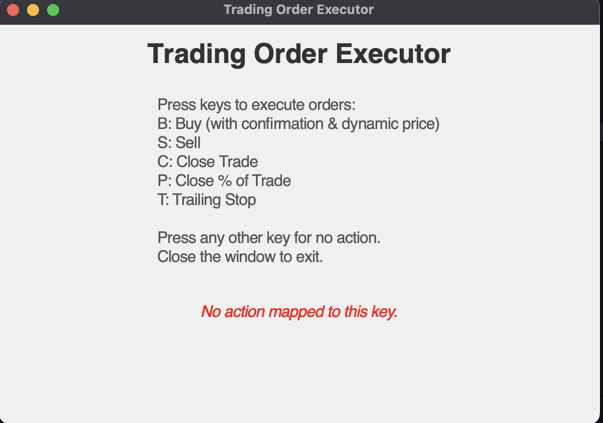

# Trading Order Executor 🚀

A simple and intuitive desktop application built with Python and Tkinter to execute stock trading orders using the Alpaca Paper Trading API.

## ✨ Features

- ✅ Place **Buy** or **Sell** orders effortlessly
- 📊 Fetch live stock prices
- 🛡️ Simulate orders using Alpaca's **Paper Trading API**
- 🖱️ User-friendly GUI with interactive confirmations
- 🧪 Error handling and status updates

## 🛠️ Installation

1. **Clone the Repository:**
   ```bash
   git clone <repo-url>
   cd trading-order-executor
   ```
2. **Install Dependencies:**
   ```bash
   pip install -r requirements.txt
   ```
3. **Set up Environment Variables:**
   Create a `.env` file with your Alpaca API credentials:
   ```env
   API_KEY=your_alpaca_api_key
   API_SECRET=your_alpaca_api_secret
   ```
4. **Run the App:**
   ```bash
   python main.py
   ```

## 🎮 Usage

- **B**: Buy (With confirmation and dynamic price)
- **S**: Sell
- **C**: Close Trade
- **P**: Close Percentage of Trade
- **T**: Trailing Stop Order

Close the window to exit.

## 🖼️ Screenshots



## 🚧 Requirements

- Python 3.8+
- Alpaca Paper Trading API Account

## 📜 License

This project is licensed under the MIT License.

## 🌟 Contributing

Feel free to submit issues and pull requests to improve the app!
